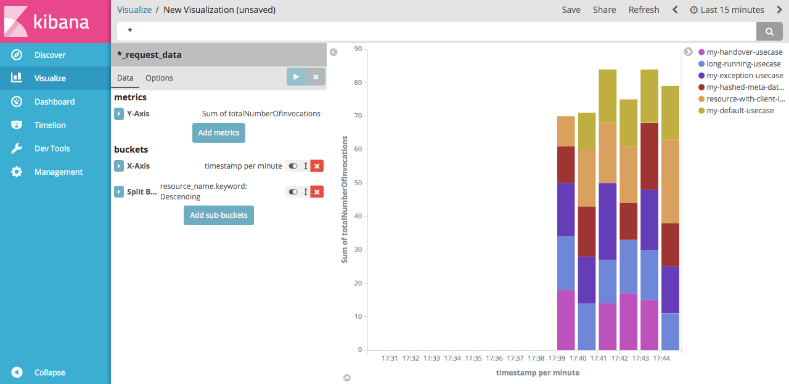

# request-tagging-demo

*Demonstrates the features of request-tagging.*

[](https://travis-ci.org/CK35/request-tagging)

This project contains a Spring Boot Application which can be build with Maven. The application generates test calls and the 
tagged data will be send to an InfluxDB by default. See below for further configuration options. You can use the provided
Grafana Dashboard for visualization.


[grafana-dashboard.json](grafana-dashboard.json)

 
```bash
#This is only required when building with latest request-tagging SNAPSHOT version.
git clone https://github.com/CK35/request-tagging.git
cd request-tagging
mvn clean install
cd ..

#Now we will clone the actual repository of the demo project.
git clone https://github.com/CK35/request-tagging-demo.git
cd request-tagging-demo
mvn clean package
```

After building you can run the application directly (It is assumed that InfluxDB is on localhost see [demo.properties](src/main/resources/demo.properties) and the database "request_data" has been created before):
```bash
java -jar target/request-tagging-demo-1.0.0-SNAPSHOT.jar
```

If you need further configuration you can set all [configuration keys](https://github.com/CK35/request-tagging/blob/master/core/src/main/java/de/ck35/monitoring/request/tagging/core/RequestTaggingContextConfigurer.java#L16) as console parameter.
```bash
java -jar target/request-tagging-demo-1.0.0-SNAPSHOT.jar --hostName=my-influx-host
```

## Send data to Elasticsearch alternatively
You can also send the request data to an Elasticsearch node. The only thing you need to do is changing the [demo.properties](src/main/resources/demo.properties).
```properties
# General configuration
requestTagging.context.collectorSendDelayDuration=PT10S
requestTagging.statusConsumer.maxDurationsPerNode=10000
requestTagging.statusReporter.sendData=true

# Configuration needed to send data to Elasticsearch
requestTagging.statusReporter.reportFormat=ELASTICSEARCH
requestTagging.statusReporter.port=9200
requestTagging.statusReporter.pathPart=/_bulk
requestTagging.statusReporter.queryPart=
```
