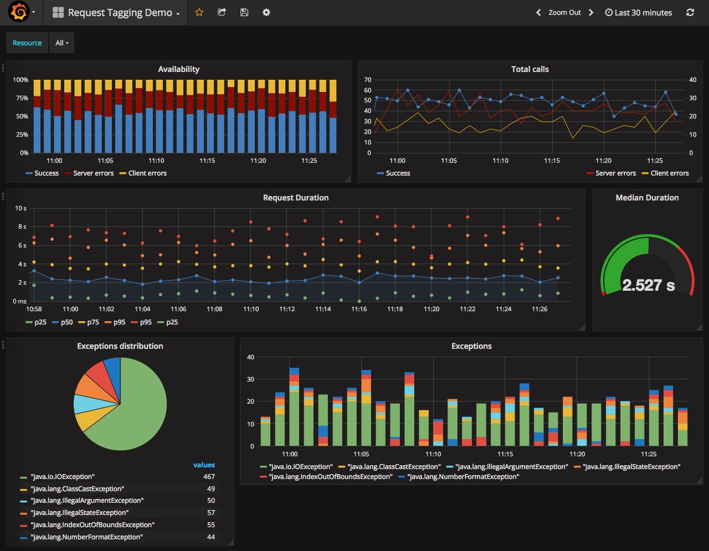

# request-tagging-demo

*Demonstrates the features of request-tagging.*

[](https://travis-ci.org/CK35/request-tagging)

This project contains a Spring Boot Application which can be build with Maven. The application generates test calls and the 
tagged data will be send to an InfluxDB by default. See below for further configuration options. You can use the provided
Grafana Dashboard for visualization.



 
```bash
//This is only required when building with latest request-tagging SNAPSHOT version.
git clone https://github.com/CK35/request-tagging.git
cd request-tagging
mvn clean install
cd ..

//Now we will clone the actual repository of the demo project.
git clone https://github.com/CK35/request-tagging-demo.git
cd request-tagging-demo
mvn clean package
```

After building you can run the application directly (It is assumed that InfluxDB is on localhost see demo.properties):
```bash
java -jar target/request-tagging-demo-1.0.0-SNAPSHOT.jar
```

If you need further configuration you can set all configuration keys as console parameter.
```bash
java -jar target/request-tagging-demo-1.0.0-SNAPSHOT.jar --hostName=my-influx-host
```